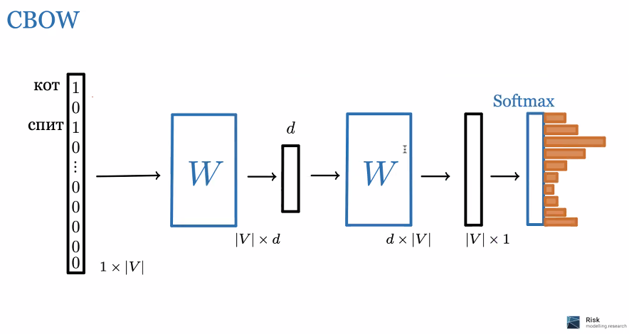

# word 2 vec

## вводное

* токен - последовательность символов
* документ - это последовательность токенов
* корпус - коллекция всех возможных документов

## подходы

### BOW мешок слов

частотный подход. Можно использовать SVD

### лемматизация

попытка уменьшить числа слов, но сохраняя  информацию, чаще по словарю

### стемминг

попытка приведения к начальным словам по правилам

### tf-idf

* Term frequency - частота токена в документе $tf(t,d) = f_{t,d}$
* inverse document frequence  - обратная частота встречания документа $idf = \log(\frac{N}{D})$
* итоговый вес $tf \cdot idf$

## про вектора

* хотим угол между похожими парами был похож
* хотим чтобы угол между парой близких слов был мал, а между несвязными - большой
* можно делать арифметику со словами

## идея Word-to-vec

*решение* - Word-to-vec

считаем, что контекст - это среднее значение из векторов.

посчитаем вероятность токена $w_0$ в зависимости от контекста

$$P(w_0|w_c) = \frac{e^s{(w_o,w_c)}}{\sum_{(i,c)}e^s{(w_i,w_c)}}$$

тут сложно - много вариантов.

решения - CBOW (непрерывний мешок) или skip-gramm (предсказать контекст по слову)

мы водим этим контекстом по корпусу и учим  нейросеть.

## fast-text

это эволиюцию vord to vec
