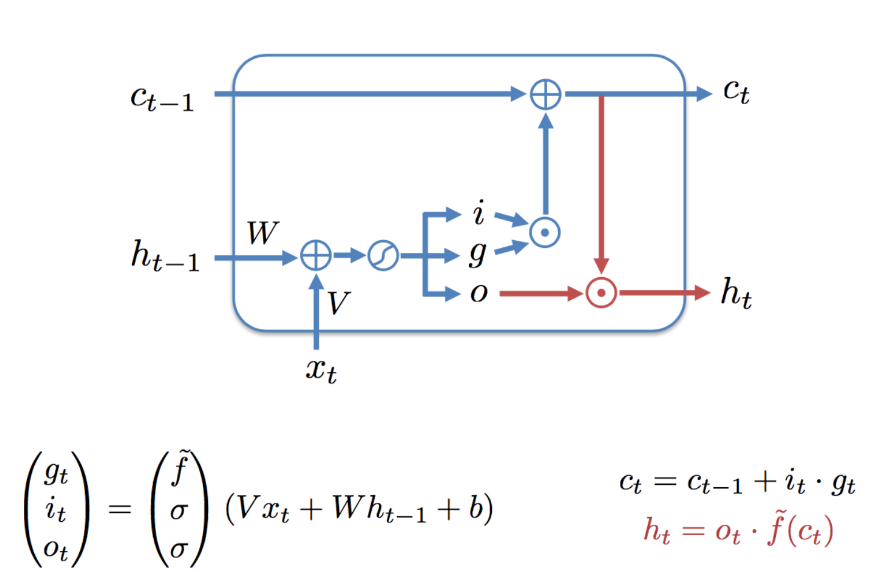
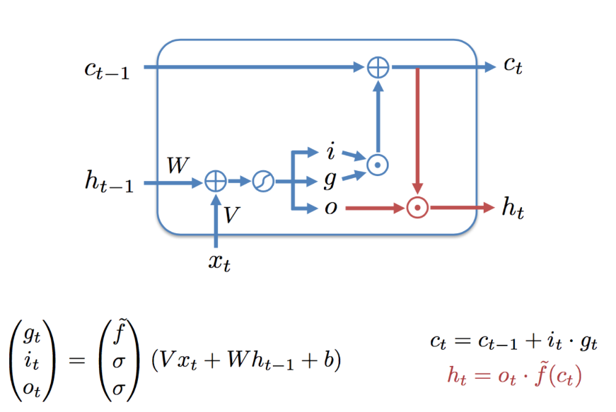

# рекурентные сети

## что новое

* у нас появляется состояние памяти
* не очень очевидный градиент

## RNN

### градиент

* $h_t = f_h(Wh_{t-1} + wb_t + b_h)$ где:
* $h_t$ - фунция активации
* $b_t$ - коэффициент

выход

* $\hat{y_t} = f_y(Yh_t +b_y)$

хотим посчитать

* $L = \sum{i=1}^t L_i$

обычно

$loss_i = MSE = L_i = (y_i - \hat{y_i})^2$

хотим: $\dfrac{\partial L_i}{\partial U} =\dfrac{\partial L_i}{\partial \hat{y_i}}\dfrac{\partial \hat{y_i}}{\partial U} = ...$

## как бороться со взярвом градиентов

* учить сеть не целиком а по кускам
* gradient clipping
* аккуратно инициализировать
* skip connection
* специальную архитектуру придумать

## LSTM

* rnn - связывает текущую информацию  с прошой. backprop кидает информации назад.
* если градиенты не взрываются, то часто не может пробросить слишком далеко назад (экспоненциально затухает)

* LSTM - добавить обучение долгосрочных зависимости

### внутри куска LSTM

* i, o - вход и выход
* g - gate - мы считаем это кандидатом на память

* $i_t$ -  сколько информации от выхода положить в долгосрочную память.

* $c_t$ - long memory state

### gru ячейка

функционал похожий lstm, меньше обучающмых параметров

### bi-lstm/bi-gru

позволяет с 2 сторон посмотреть
