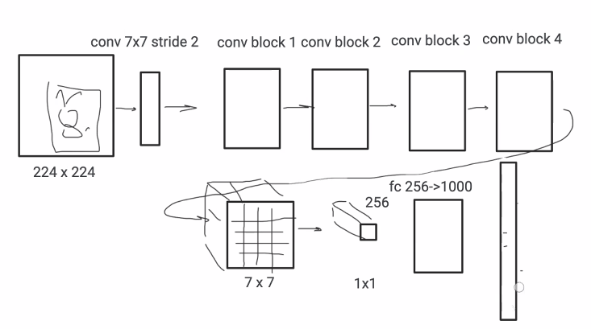

# детекция

что-то на статичной картинке - найти объекты и обозначить их (прямоугольник или параллепипд, который занимает)

## общие слова

### примеры

* про птиц детектировать - это классификация чаще
* детекция продуктов на полке
* лица в машинном зрении

### про работу resnet

* после конволюций - сделать GLAP - global average pooling - убить все разрешение - получить 1х1х1000
* потом Fc
* потом выход по классам

label studio

https://colab.research.google.com/drive/1NRO2ROB64UHak9B4m_cqgHAkC7RQpJJl?usp=sharing
